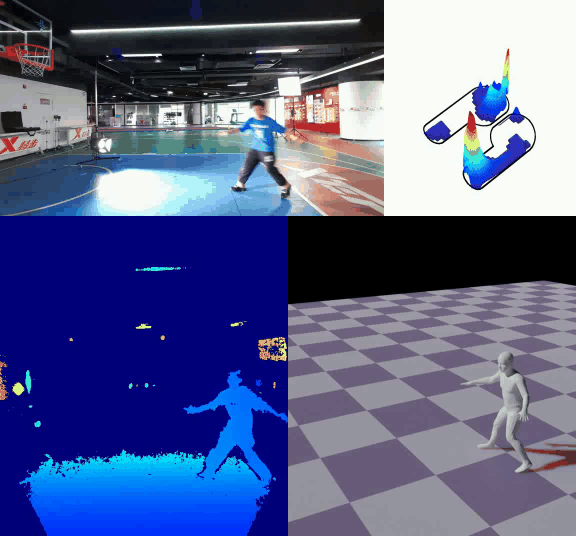

# MMVP

This repo is used for optimzation and visualization for MMVP dataset:

MMVP: A Multimodal MoCap Dataset with Vision and Pressure Sensors  
[He Zhang](https://github.com/zhanghebuaa), [Shenghao Ren](https://www.wjrzm.com/), [Haolei Yuan](https://github.com/haolyuan),
Jianhui Zhao, Fan Li, Shuangpeng Sun, Zhenghao Liang, [Tao Yu](https://ytrock.com/), Qiu Shen, Xun Cao

# Overview

# News
- **[25/03/24]**: Code for optimzation are released!

# Demo
Demo for visulization are coming soon!
Instruction for optimzation are coming soon!
## TODO:
- [ ] add instruction for multi-mudal data optimzation.

# Datasets
MMVP dataset are following the structure below.

# Citation

# License
